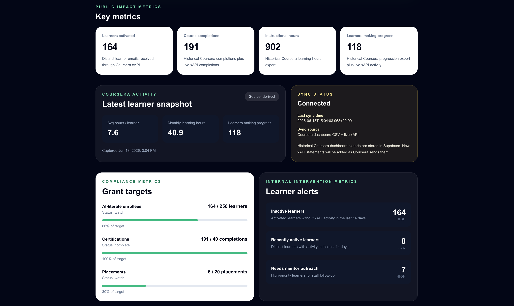
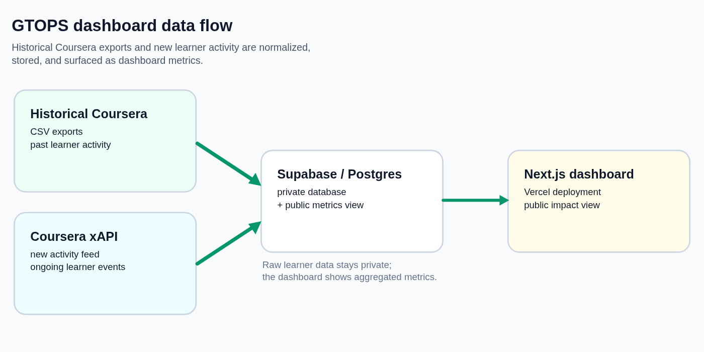

# GTOPS Impact Dashboard

A Next.js dashboard that turns Coursera learner activity and program metrics into clear public reporting for GTOPS / EC4A's digital skills programs. Data lives in Supabase, fed by a historical CSV backfill and a live xAPI receiver for new activity.

**Live dashboard:** https://gtops-dashboard.vercel.app/
**Case study:** https://yannik-baurle.codeberg.page/portfolio/gtops-dashboard/



## The problem

GTOPS / EC4A needed a clearer way to show the impact of its Coursera-based programs. The information was spread across Coursera reports, historical exports, grant goals and planning conversations, so simple questions were slow to answer: How many learners are we reaching? Are they making progress? How many complete courses or certifications? How are we tracking against grant goals?

## How it works



- **Historical activity:** Coursera dashboard reports, exported as CSV, are loaded into Supabase by an import script.
- **New activity:** an xAPI receiver authenticates Coursera, accepts incoming learning statements, normalizes the useful fields, and stores both the raw statement and the reporting fields.
- **Reporting:** the dashboard reads summary metrics from Supabase. If the database is unavailable, it falls back to sample data instead of breaking.

The dashboard covers public impact numbers, Coursera learner activity, grant targets, learner alerts and data sync status. It's designed for two audiences: a simple public view for partners and funders, and a more detailed view for staff and digital navigators.

## Privacy by design

Individual learner records stay in private Supabase tables protected by Row Level Security. The public dashboard reads only aggregated summary metrics, so it can show program impact without exposing anyone's details.

This repository contains no environment files, secrets or Coursera exports.

## What I built

| Area | What I built |
|---|---|
| Front end | Next.js / TypeScript dashboard with Tailwind styling |
| Database | Supabase/Postgres schema with private tables and public summary metrics |
| Historical data | Import script for Coursera dashboard CSV exports |
| New activity | xAPI token endpoint and statement receiver |
| Deployment | Vercel production deployment with environment-based configuration |
| Documentation | Setup, xAPI receiver, Supabase, deployment and backfill notes |

## Run it locally

Requires Node.js and a Supabase project.

```
npm install
npm run dev
```

Configuration (Supabase URL and keys, xAPI credentials) goes in a local `.env.local` file, which is never committed. The setup notes in this repository describe each setting.

## What I'd do differently

1. **Separate the public and internal views from the start.** Different audiences need different levels of detail.
2. **Agree on metric definitions before building visuals.** Terms like activated learner, completion, certification and placement need shared definitions so every number has a clear meaning.
3. **Show progress over time.** Monthly charts of enrollment, completions and certifications tell a stronger story than static totals.

## Notes

Built with AI-assisted development (Pi coding agent) for inspecting the codebase, drafting parts of the dashboard and reasoning through the data flow. I reviewed, tested and made the final implementation decisions.
